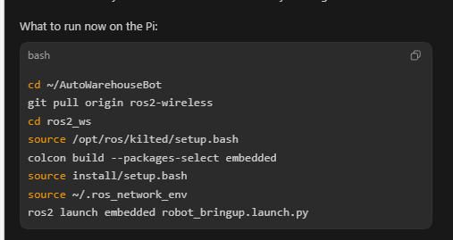
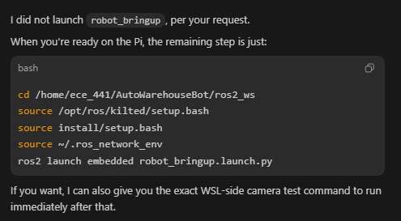
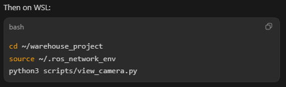

# Startup Scripts

These scripts are committed to the repo so they can be pushed on a branch and
shared with the team.

They are meant to be run from WSL.








## What They Do

- `scripts/start_pi_robot.sh`
  Starts the Raspberry Pi hardware bringup over SSH
- `scripts/start_wsl_navigation.sh`
  Starts the WSL navigation stack locally
- `scripts/start_robot_stack.sh`
  Starts the Pi bringup first, then starts the WSL navigation stack
- `scripts/stop_robot_stack.sh`
  Kills the known ROS processes on both WSL and the Pi so you do not have to
  hunt down hung processes manually
- `scripts/drive_test.sh`
  Legacy `/cmd_vel` test publisher (movement pipeline now uses distance/angle topics)

Bridge implementation note:

- `robot_bringup.launch.py` now runs `serial_bridge_py` (Python) as node name
  `/serial_bridge`
- This is intentional for faster iteration and easier debugging on Pi

## Prerequisites

Before using the scripts, both machines should already have:

- `~/.ros_network_env`
- `~/.bashrc` sourcing `~/.ros_network_env`

See the local troubleshooting docs for the exact file contents.

The WSL machine must also be able to SSH into the Pi.

## First Troubleshoot Step (Always)

If topics are missing on WSL, treat this as a networking/firewall issue first.
Do this before debugging launch files or hardware nodes.

1. Run demo-node sanity check:
   On Pi:

```bash
source ~/.ros_network_env
ros2 run demo_nodes_cpp talker
```

On WSL:

```bash
source ~/.ros_network_env
ros2 run demo_nodes_cpp listener
```

2. If listener does not receive messages, fix Windows firewall rule first (see
   `troubleshooting/network-fixes.md`).
3. Only after demo nodes work should you continue to Pi bringup and WSL nav.

## SSH Authentication

The scripts support either:

1. normal SSH keys
2. password-based SSH using `PI_PASSWORD`

Example with password auth:

```bash
export PI_PASSWORD='group4pi'
./scripts/start_robot_stack.sh
```

If you use SSH keys, you do not need `PI_PASSWORD`.

## Machine-Specific Variables

You can override these if needed:

```bash
export PI_USER=ece_441
export PI_HOST=104.194.126.139
export PI_WORKSPACE=/home/ece_441/AutoWarehouseBot/ros2_ws
export LOCAL_WORKSPACE=/home/felix/warehouse_project/ros2_ws
export USE_RVIZ_VALUE=false
```

## Typical Usage

### Start everything from WSL

```bash
export PI_PASSWORD='group4pi'
./scripts/start_robot_stack.sh
```

That will:

1. stop any old Pi bringup processes
2. start `robot_bringup.launch.py` on the Pi
3. wait a few seconds
4. stop any old WSL navigation processes
5. start `hardware.launch.py` on WSL

### Start only the Pi hardware side

```bash
export PI_PASSWORD='group4pi'
./scripts/start_pi_robot.sh
```

### Start only the WSL navigation side

```bash
./scripts/start_wsl_navigation.sh
```

### Stop everything cleanly

```bash
export PI_PASSWORD='group4pi'
./scripts/stop_robot_stack.sh
```

### Movement Commands (current API)

After Pi bringup is running, use exact linear/angle commands:

```bash
source ~/.ros_network_env
ros2 topic pub --once /move_distance_mm std_msgs/msg/Int32 "{data: 500}"
ros2 topic pub --once /move_distance_mm std_msgs/msg/Int32 "{data: -300}"
ros2 topic pub --once /rotate_angle_deg std_msgs/msg/Int32 "{data: 90}"
ros2 topic pub --once /rotate_angle_deg std_msgs/msg/Int32 "{data: -45}"
```

These commands can be run from either Pi or WSL (after sourcing that machine's
`~/.ros_network_env`).

Command convention:

- `/move_distance_mm`
  - positive value = move forward
  - negative value = move backward
  - units are millimeters
- `/rotate_angle_deg`
  - positive value = rotate counterclockwise
  - negative value = rotate clockwise
  - units are degrees

Examples:

```bash
# Forward 300 mm
ros2 topic pub --once /move_distance_mm std_msgs/msg/Int32 "{data: 300}"

# Backward 300 mm
ros2 topic pub --once /move_distance_mm std_msgs/msg/Int32 "{data: -300}"

# Rotate left / CCW by 45 deg
ros2 topic pub --once /rotate_angle_deg std_msgs/msg/Int32 "{data: 45}"

# Rotate right / CW by 45 deg
ros2 topic pub --once /rotate_angle_deg std_msgs/msg/Int32 "{data: -45}"
```

### Camera Viewing (current working setup)

The current working camera path is:

- Pi `usb_cam` publishes honest decoded frames with:
  - `image_width: 320`
  - `image_height: 240`
  - `framerate: 10.0`
  - `pixel_format: mjpeg2rgb`
- WSL viewer:

```bash
cd ~/warehouse_project
source ~/.ros_network_env
python3 scripts/view_camera.py
```

Useful quick checks:

```bash
source ~/.ros_network_env
ros2 topic hz /camera/image_raw
ros2 topic echo --once /camera/camera_info
```

Important note:

- plain `pixel_format: mjpeg` is not supported by this `usb_cam` ROS driver
- `raw_mjpeg` is efficient, but on this setup it produced misleading raw-topic behavior
- `mjpeg2rgb` is the honest and currently reliable path

Latency / bandwidth suggestions if camera is still too slow:

- lower framerate further, for example from `10.0` to `5.0`
- lower resolution further, for example from `320x240` to `160x120`
- keep RViz off while testing camera over Wi-Fi
- avoid multiple WSL viewers or extra `ros2 topic echo` subscribers on image topics
- close unused nodes on the Pi, especially anything heavy on CPU
- if you later need the absolute lowest network load, revisit a true compressed-image transport path, but only if the driver publishes it honestly

Safety note:

- Keep wheels lifted or clear space for first test
- Verify ticks (`/left_ticks`, `/right_ticks`) respond during command execution

Movement topic contract:

- `/move_distance_mm` (signed mm): positive forward, negative backward
- `/rotate_angle_deg` (signed deg): positive CCW, negative CW

See `docs/firmware-protocol.md` for protocol details and tuning notes.

## What Gets Killed

The stop script intentionally kills the usual bringup processes so stale copies
do not accumulate.

On the Pi it targets things like:

- `robot_bringup.launch.py`
- `usb_cam_node_exe`
- `imu_node`
- `serial_bridge`
- `wheel_odometry`
- `ekf_node`
- `rplidar_composition`

On WSL it targets things like:

- `hardware.launch.py`
- `rviz2`
- `component_container_isolated`
- Nav2 servers
- `robot_state_publisher`
- local `ekf_node`

## Why This Helps

During debugging, duplicate Pi bringups and duplicate sensor nodes caused a lot
of confusion. These scripts are meant to keep startup and shutdown consistent so
you do not have to manually clean up zombie processes.

## Manual Recovery (Known-Good)

If the PC/WSL side is lagging hard, a full PC restart can clear stuck network
state and make ROS discovery stable again.

After reboot, this manual Pi-first flow is a known-good recovery:

1. On Pi:

```bash
source ~/.ros_network_env
ros2 launch embedded robot_bringup.launch.py
```

2. In another Pi terminal, verify:

```bash
source ~/.ros_network_env
ros2 node list
ros2 topic list
```

Expected healthy baseline includes nodes like:

- `/imu_node`
- `/rplidar_node`
- `/usb_cam`

Expected topic set includes at least:

- `/camera/image_raw`
- `/imu/data`
- `/odom`
- `/cmd_vel`
- `/tf`
- `/tf_static`

If this looks good on Pi, then move to WSL and start listener/navigation side.
